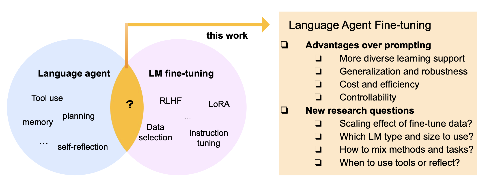

# FireAct: Toward Language Agent Fine-tuning

<p>
    <a href="https://www.python.org/">
        
    </a>
    <a href="https://copyright.princeton.edu/policy">
        
    </a>
    <a href="https://zenodo.org/badge/latestdoi/642099326">
        
    </a>
</p>




This repository is based on our publication *FireAct: Toward Language Agent Fine-tuning* ([link](https://fireact-agent.github.io)). It contains prompts, demo code and fine-tuning data we generated. It also includes the description and directory for the model family we fine-tuned. If you use this code or data in your work, please cite:

```
Bibtex code
```

## Overview
- Define tools in `tools/`
- Define tasks in `tasks/`
- Collect data & run experiments via `generation.py` 
- Results will be saved in `trajs/`


## Data & Prompts
- Data to generate training data and run experiments in `data/`. We also include samples of training data for both Alpaca format and GPT format. See details [here](https://github.com/anchen1011/FireAct/tree/main/data).
- Prompts to generate training data and run experiments in `prompts/`

## Setup

Set up OpenAI API key and store in environment variable  (see [here](https://help.openai.com/en/articles/5112595-best-practices-for-api-key-safety))

```
export OPENAI_API_KEY=<YOUR_KEY>
```
 
Set up SERP API key and store in environment variable (see [here](https://serpapi.com))

```
export SERPAPI_API_KEY=<YOUR_KEY>
```

Create virtual env, for example with conda

```
conda create -n fireact python=3.9
conda activate fireact
```

Clone this repo and install dependencies

```
git clone https://github.com/anchen1011/FireAct.git
pip install -r requirements.txt
```

## Run Demo

#### Data Generation

Example:

```
python generation_react.py \
    --task hotpotqa \
    --backend gpt-4 \
    --promptpath default \
    --evaluate \
    --random \
    --task_split val \
    --temperature 0 \
    --task_end_index 5
```

See details with command `python generation.py -h`

You need to set a high number (thousands) of `--task_end_index` to get sufficient good data samples. **[WARNING] This is costly with gpt-4 and serpapi.**

You need to convert trajectories into [alpaca format](https://github.com/tatsu-lab/stanford_alpaca#data-release) or [gpt format](https://platform.openai.com/docs/guides/fine-tuning/preparing-your-dataset) for training. See our examples [here](https://github.com/anchen1011/FireAct/tree/main/data/finetune).

#### Supervised Fine-tuning

Example:

```
cd finetune/llama_lora
python finetune.py \
    --base_model meta-llama/Llama-2-13b-chat-hf \
    --data_path ../../data/finetune/hotpotqa_alpaca.json \
    --micro_batch_size 8 \
    --num_epochs 30 \
    --output_dir ../../models/lora/fireact-llama-2-13b \
    --val_set_size 0.01 \
    --cutoff_len 512 \
```

See details [here](https://github.com/anchen1011/FireAct/tree/main/finetune).

#### Inference

Example (FireAct Llama):

```
python generation.py \
    --task hotpotqa \
    --backend llama \
    --evaluate \
    --random \
    --task_split dev \
    --task_end_index 5 \
    --modelpath meta-llama/Llama-2-7b-chat \
    --add_lora \
    --alpaca_format \
    --peftpath forestai/fireact_llama_2_7b_lora 
```

Example (FireAct GPT):

```
python generation_react.py \
    --task hotpotqa \
    --backend ft:gpt-3.5-turbo-0613:<YOUR_MODEL> \
    --evaluate \
    --random \
    --task_split dev \
    --temperature 0 \
    --chatgpt_format \
    --task_end_index 5
```

See details with command `python generation.py -h`

Set `--task_end_index 500` for quantitative evaluations. See our examples [here](https://github.com/anchen1011/FireAct/tree/main/trajs).

## Model Zoo

We release a selected set of multitask models based on Llama family. Details can be found in their model cards. 

| Base Model    | Training Method | Hugging Face                                               |
|---------------|-----------------|------------------------------------------------------------|
| Llama2-7B     | LoRA            | [forestai/fireact\_llama\_2\_7b\_lora](https://huggingface.co/forestai/fireact_llama_2_7b_lora)    |
| Llama2-13B    | LoRA            | [forestai/fireact\_llama\_2\_13b\_lora](https://huggingface.co/forestai/fireact_llama_2_13b_lora)   |
| CodeLlama-7B  | LoRA            | [forestai/fireact\_codellama\_7b\_lora](https://huggingface.co/forestai/fireact\_codellama\_7b\_lora)  |
| CodeLlama-13B | LoRA            | [forestai/fireact\_codellama\_13b\_lora](https://huggingface.co/forestai/fireact\_codellama\_13b\_lora) |
| CodeLlama-34B | LoRA            | [forestai/fireact\_codellama\_34b\_lora](https://huggingface.co/forestai/fireact\_codellama\_34b\_lora) |
| Llama2-7B     | Full Model      | [forestai/fireact\_llama\_2\_7b](https://huggingface.co/forestai/fireact_llama_2_7b)         |


## References
1. Our generation code is based on [ysymyth/ReAct](https://github.com/ysymyth/ReAct)
2. Our Llama full model training code is based on [tatsu-lab/stanford_alpaca](https://github.com/tatsu-lab/stanford_alpaca)
3. Our Llama LoRA training code is based on [tloen/alpaca-lora](https://github.com/tloen/alpaca-lora)
4. Our GPT fine-tuning code is based on [anchen1011/chatgpt-finetune-ui](https://github.com/anchen1011/chatgpt-finetune-ui/)
